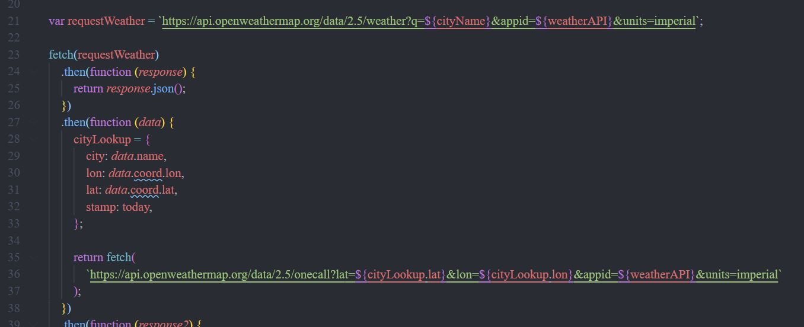
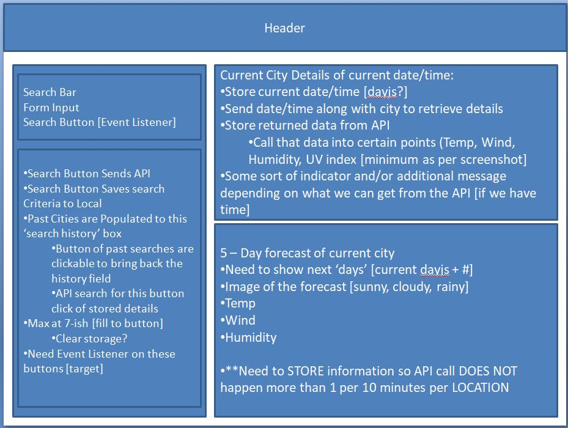

# Weather Dashboard

https://brownnicholasj.github.io/weather_dashboard/

## Description

The Weather Dashboard was designed to allow a user to plan travel to multiple
cities on their trip. This will provide the user with the current weather
attributes along with a 5 day forecast. Upon searching, searched locations will
be saved for quick retrieval.

- Allows the user to input cities of their choice
- The users search results are saved in reverse-chronological order (most recent
  search is first on the saved list).
- Results are saved to local storage, so when the suer exits the site and
  returns, saved searches are retained.

- The biggest learning curve on this project was understanding/handling the
  requirements from the API, specifically looking up by city was only available
  for current weather data - so we had to utilize the lon/lat from that call to
  call a more complex call [one call API].

## Table of Contents

- [Features](#features)
- [Credits](#credits)
- [Tests](#tests)
- [Development_Concepts](#development_concepts)

## Features

The page has a mobile first design, allowing users to utilize the page from a
smaller screen along with larger screen.
  The page utilizes openWeather
API to get data for current date and 5 days future forecast. Had to call the
current forecast because that is the only API that could accept city only
request. Utilized the lon/lat from that response to retrieve more detailed
response with current weather + future forecast
  Upon submitting a request, the
city that was searched is stored for button click retrieval. Additionally, the
search results are stored in localStorage to allow the previous searches to be
recalled upon returning to the webpage
  Results are shown for the
current date in one box/section, then future forecast for 5-days are stored in
the lower box/section.   The UV
Index will have a color coded graphic of (green/yellow/red) based on the epg.gov
recommendations of less than or equal to 2 is low [good], below 5 is medium
[moderate], and above 5 is high [protection strongly advised].

## Credits

The formatting of the webpage utilizes Bootstrap (https://getbootstrap.com/).
  The formatting of the webpage utilizes FontAwesome
(https://fontawesome.com/)  The formatting of the webpage utilizes Google
fonts (https://fonts.google.com/)  The date functionality of the webpage
utilizes Dayjs date library.<br.>The API data is from OpenWeatherMap
(https://openweathermap.org/)

## Tests

1. Search results [basic].

- Input any city (ex: New York) and click 'Submit'

  - data is populated for that city for both current and 5 day forecast sections

  

2.  Saved search [chained]

- Input any city (ex: New York) and click 'Submit'
  - search is saved below in grey button
- Input another city (ex: Chicago) and click 'Submit'

  - new search is saved and is the first on the list as the 'most recent search'

  

3.  Local storage [saved results]

- close browser after test 1 and test 2, open browser and return to site.

  - saved cities [searches] are still shown in the saved cities list

  

4. Saved searches are clickable a data retrievable

- after test 1 or test 2, click on any saved city button

  - respective cities data is pulled back into the current and 5-day forecast
    sections

    

5.  UV Index indicator (green/yellow/red)

- search for a city and the UV Index results will be color coded based on the
  following results (<= 2 == green, >2 && <= 5 == yellow, >5 == red)

  - may need to try multiple cities/locations to pull different UV index values

  

## Development_Concepts

Wireframe/Pseudocode:

- utilized a wireframe and some simple pseudocode to plan the project and design
  

Development Git Branch

- utilized non-live (not main) branch to push commits through development. Main
  branch will have a few commits to it.
  - comparing develop branch to main branch to validate the usage and committing
    frequency
